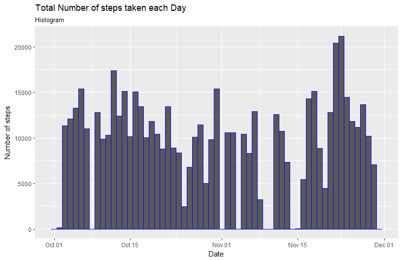
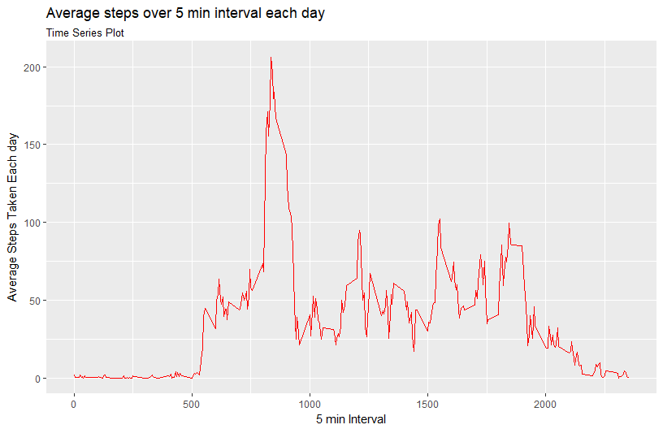
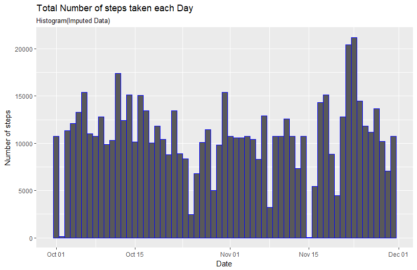
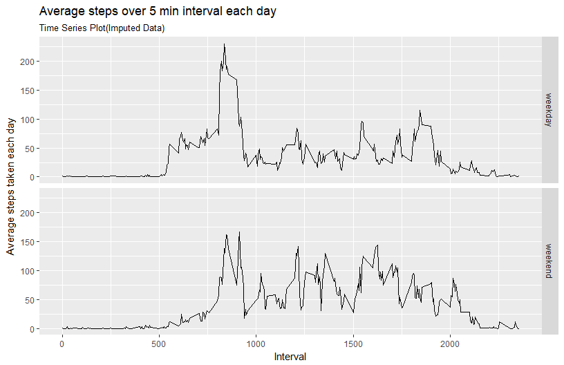

# Reproducible Research: Peer Assessment 1
M.Vigneshwar  


## Loading and preprocessing the data


```r
unzip("activity.zip",exdir = "./data") # unzip the files and extract to the data folder
activity <- read.csv("./data/activity.csv")# read the dataset into activity dataframe
activity$date<-ymd(activity$date) # convert the date variable as a date using ymd(lubridate pkg)
```


## What is mean total number of steps taken per day?

```r
# Group the activity df by date, find the total steps taken each day and store it in df1
df1<-activity%>%
           group_by(date)%>%
           summarise(sum=sum(steps))
# Use ggplot to form the histogram with the frequency(sum) as the weight aesthetics 
ggplot(df1,aes(date))+
      geom_histogram(aes(weight=sum),
                     color="blue",
                     bins=61)+
        labs(x="Date",
             y="Number of steps",
             title="Total Number of steps taken each Day",
             subtitle="Histogram")
```

<!-- -->

```r
mean(df1$sum,na.rm = T) # Mean of the total number of steps taken each day
```

```
## [1] 10766.19
```

```r
median(df1$sum,na.rm = T) # Median of the total number of steps taken each day
```

```
## [1] 10765
```


## What is the average daily activity pattern?


```r
# Group the activity dataframe by interval and summarise mean steps into Avg_steps column
df2<-activity%>%
        group_by(interval)%>%
        summarise(Avg_steps=mean(steps,na.rm=T))
# Plot a time series plot
ggplot(df2,aes(interval,Avg_steps))+
      geom_line(color="red")+
        labs(x="5 min Interval",
             y="Average Steps Taken Each day", 
             title ="Average steps over 5 min interval each day", 
             subtitle="Time Series Plot")
```

<!-- -->

```r
ggsave("./Plot2.png")
```

```
## Saving 8.5 x 5.5 in image
```

```r
# Maximum of the mean steps in an interval
df2[which.max(df2$Avg_steps),]
```

```
## # A tibble: 1 x 2
##   interval Avg_steps
##      <int>     <dbl>
## 1      835  206.1698
```

## Imputing missing values

```r
apply(activity,2,function(x){sum(is.na(x))}) # To find the NA values
```

```
##    steps     date interval 
##     2304        0        0
```

```r
# summary(activity) can also be used to view the number of NA values

# Impute the missing values with the mean number of steps taken in that particular interval
activity$steps<-ifelse(is.na(activity$steps),
                       round(df2$Avg_steps[match(df2$interval,activity$interval)]),
                       activity$steps)
# Group by date variable and find the total number steps taken each day
df3<-activity%>%
      group_by(date)%>%
      summarise(sum=sum(steps))
# Make a histogram with the imputed data
ggplot(df3,aes(date))+
      geom_histogram(aes(weight=sum),
                     bins = 61,
                     color="blue")+
      labs(x="Date",
           y="Number of steps",
           title="Total Number of steps taken each Day",
           subtitle="Histogram(Imputed Data)")
```

<!-- -->

```r
ggsave("./Plot3.png")
```

```
## Saving 8.5 x 5.5 in image
```


## Are there differences in activity patterns between weekdays and weekends?

```r
# Create a factor variable wday with levels weekend and weekday
activity$wday <- ifelse(wday(activity$date) %in% c(1,7),"weekend","weekday")
# Group by wday and interval variable and find the average number of steps taken in each interval for either weekday or weekend
df4<-activity%>%
      group_by(wday,interval)%>%
      summarise(avg_steps=mean(steps))
# Make a time series plot showing the difference in the number of steps walked during weekend and weekday 
ggplot(df4,aes(interval,avg_steps))+
      geom_line()+
      facet_grid(wday~.)+
      labs(x= "Interval", y= "Average steps taken each day",
           title ="Average steps over 5 min interval each day", 
             subtitle="Time Series Plot(Imputed Data)")
```

<!-- -->

```r
ggsave("./Plot4.png")
```

```
## Saving 8.5 x 5.5 in image
```

